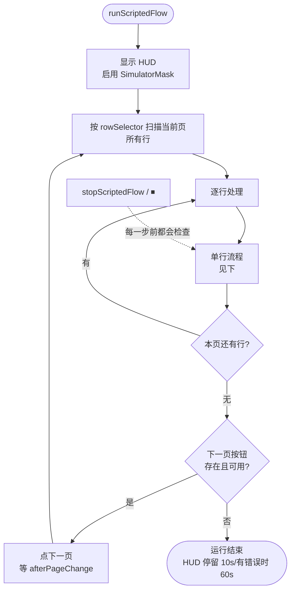
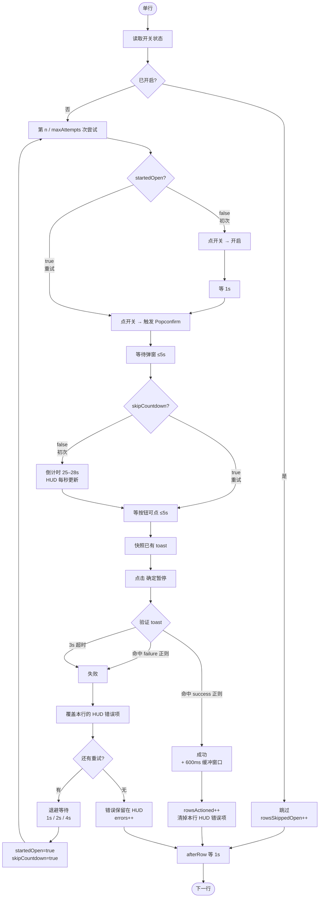
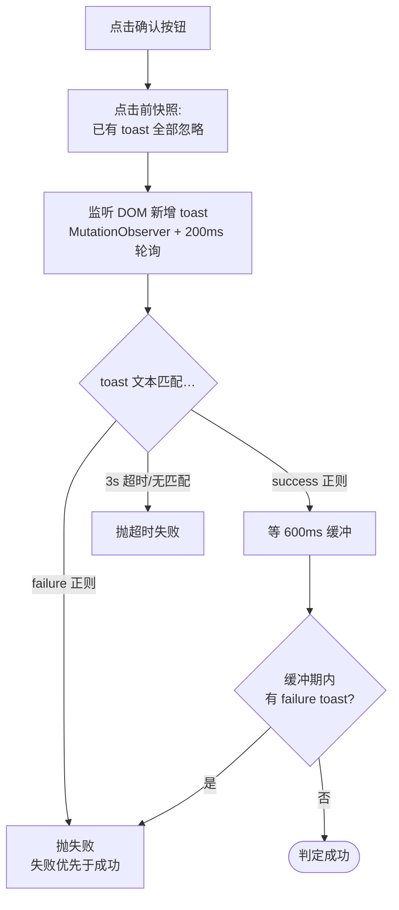

# Scripted Flow

一种**不依赖 AI 的固定流程自动化**：复用 page-agent 的动效鼠标 + 视觉遮罩，
但绕过 LLM。适用于"对每页每行执行同一套已知步骤"这种场景——步骤事先就清楚，
让 AI 来判断既慢又贵，没必要。

参考流程是 **拼多多推广列表 `yingxiao.pinduoduo.com/goods/promotion/list`
的批量暂停**，但 runner 本身是通用的：行选择器、弹窗目标、确认按钮文案、翻页
按钮等全部由 `ScriptedFlowConfig` 配置驱动，其他表格类后台都能接入。

---

## TL;DR

```js
// 1. 加载 page-agent（demo bundle 自带 🤖 按钮）
//    在 https 站点上使用 bookmarklet:
javascript:(function(){var s=document.createElement('script');s.src=`https://localhost:5174/page-agent.demo.js?t=${Math.random()}`;s.onload=()=>console.log('PageAgent demo ready!');document.head.appendChild(s);})();

// 2. 点击面板头部的 🤖 → 在弹出框中选择 "PDD 批量暂停"
//    或者从控制台直接运行：
window.runScriptedFlow(window.scriptedFlowPresets.pddPromotion)

// 3. 提前停止：
window.stopScriptedFlow()
```

左上角 HUD 实时显示进度、倒计时、成功/跳过/失败计数和实时错误列表。

---

## 架构

| 文件                                              | 职责                                                                |
| ------------------------------------------------- | ------------------------------------------------------------------- |
| `packages/page-agent/src/scripted-flow.ts`        | 纯模块：类型、runner、HUD、按钮注入器、预设                         |
| `packages/page-agent/src/scripted.ts`             | 独立 IIFE 入口 —— 暴露 `window.runScriptedFlow`                     |
| `packages/page-agent/src/demo.ts`                 | Demo IIFE 入口 —— 同时把 🤖 按钮注入面板                            |
| `packages/page-agent/vite.scripted.config.js`     | 构建 `dist/iife/page-agent.scripted.js`（约 67 kB）                 |
| `packages/page-agent/.dev-certs/`                 | mkcert 签发的本地 HTTPS 证书（已 gitignore，跑 `npm run setup:dev-certs` 生成） |
| `packages/website/src/pages/home/HeroSection.tsx` | 通过 `page-agent/scripted-flow` 子路径懒加载按钮注入器              |

公共 API：

```ts
import {
    runScriptedFlow,
    stopScriptedFlow,
    isScriptedFlowRunning,
    injectScriptedFlowButton,
    pddPromotionPreset,
    type ScriptedFlowConfig,
    type ScriptedFlowItem,
} from 'page-agent/scripted-flow'
```

子路径导出**仅限 dev**：`package.json` 的 `exports` 暴露它，但
`publishConfig.exports` 让发布到 npm 的包对外只保留 `.` 主入口。

---

## 整体流程



## 单行流程



### 为什么 CLOSED 状态要点两次？

因为用户描述的拼多多推广列表流程是"对每个已暂停的行，先短暂打开再触发暂停确认
对话框并确认"。这种"两连点"是在 CLOSED 起点行上**稳定唤起 PDD 的 `<Popconfirm>`
组件**的可靠方法。

### 重试路径：`startedOpen = true`

第一次尝试失败时（比如服务端限流），开关会停留在 **OPEN** 状态——第一次点击把
CLOSED→OPEN 切换了，但第二次点击和确认被拒，所以"关掉"这个动作没真正落地。

重试时因此**跳过初次激活步骤**：开关已经 OPEN，再点一次就能直接触发暂停
Popconfirm。

### 重试跳过指定的倒计时

`delays.beforeConfirm` 倒计时（默认 28s，可在弹出框输入框中按流程修改 ——
最近一次值会持久化到 localStorage）只在初次尝试运行。重试依赖
`等按钮可点 (≤5s)` 这个安全网清掉 PDD 的反刷限制。如果 PDD 强制了"每次重开
弹窗 30s 锁定"，这一步会超时让本次重试快速失败 —— 下一轮更长的退避（1s → 2s
→ 4s）会给限流窗口足够的过期时间。

---

## 重试 & 术语

> "3 次重试" 指**初次之外的 3 次重试**。总数 = 1 次初次 + 3 次重试 = **4 次尝试**。
> HUD 显示的是 `1/4`、`2/4`……分母是总尝试数，不是重试次数。

`retry.backoffMs` 是**每次重试前**的等待数组，长度 = `总尝试数 − 1`：

| `backoffMs`            | 总尝试数 | 尝试间等待序列 |
| ---------------------- | -------- | -------------- |
| `[1000, 2000, 4000]`（默认） | 4        | 1s、2s、4s     |
| `[2000, 5000]`         | 3        | 2s、5s         |
| `[]`                   | 1（无重试） | —              |

### 错误的逐次上报

每次失败的尝试会**覆盖**该行在 HUD 错误列表中的条目（而不是失败 4 次就堆 4
行）。列表展示每行的最新状态：

- 重试中：`P3·R1 [尝试 2/4] 操作频繁，请稍后再尝试`
- 4 次都失败后：`P3·R1 [4 次尝试均失败] 操作频繁...`
- 重试成功后：该条目会**从列表中移除**。

有错误结尾的运行，HUD 停留 60s（无错误是 10s），方便操作人员看清再自动消失。

---

## 基于 toast 的结果验证

点完确认按钮后，runner 不会以"没抛异常"作为成功标志 —— 那只能说明点击事件
被派发出去了。服务端可能依然拒绝操作，并通过 toast 提示。

```ts
confirm: {
    text: '确定暂停',
    verify: {
        success: /(暂停|开启|操作)成功/,
        failure: /操作频繁|请稍后|请重试|请勿|频率|限流|太快
                 |失败|错误|异常|不能|未能|无法|拒绝/,
        timeoutMs: 3000,
    },
},
```



验证规则：

1. **失败优先于成功**。如果两种 toast 同时出现（实际观测到 PDD 在限流时会同时
   显示 "暂停成功" 和 "操作频繁"），失败胜出。
2. **成功要等 600ms 缓冲窗口才落定**，让后续可能出现的失败 toast 还有覆盖机会。
3. **超时无反馈算失败** —— 重试一次比静默判定 "点了就当成功" 更稳妥。
4. **点击前已有的 toast 会被忽略**：动作前先做快照。否则上一行残留的"暂停成功"
   会粘到下一行的验证上。

Toast 扫描默认覆盖常见组件根：

```
[class*="anq-message"], [class*="anq-notification"], [class*="anq-toast"],
[class*="ant-message"], [class*="ant-notification"], [class*="MS-message"],
[class*="message-notice"], [class*="notification-notice"],
[role="alert"], [role="status"]
```

如果你的目标站点 toast 根不一样，通过 `verify.scanSelector` 覆盖即可。

---

## HUD 浮层

左上角，固定定位，半透明深色面板，等宽字体。从上到下依次：

| 区段     | 内容                                                            |
| -------- | --------------------------------------------------------------- |
| 标题     | `🤖 Scripted Flow  📄 第 N / M 页  🔘 第 i / N 行`              |
| 状态     | 实时：`🖱 第 1 次点击开关`、`⏳ 倒计时：剩余 14s`、`✅ 已暂停`…   |
| 统计     | `✓ 已暂停 N  ⏭ 已开/无开关 M  ✗ 失败 K`                          |
| 错误列表 | 每行一条，按 (页, 行) 维度只保留最新状态                        |

错误列表在第一次出错前是隐藏的，超过部分内部滚动，最大约 `38vh`。HUD 设置了
`pointer-events: none`，叠在遮罩之上，并通过 `data-page-agent-ignore` 让自己
不出现在任何 DOM 扫描结果里。

---

## 拼多多预设

```ts
export const pddPromotionPreset: ScriptedFlowConfig = {
    rowSelector: '.anq-table-row',
    toggleSelector: '.anq-switch, [role="switch"]',
    popup: {
        selector: '.anq-popover',
        timeoutMs: 5000,
    },
    confirm: {
        text: '确定暂停',
        verify: {
            success: /(暂停|开启|操作)成功/,
            failure: /操作频繁|请稍后|...|拒绝/,
            timeoutMs: 3000,
        },
    },
    nextPage: {
        selector: '.anq-pagination-next',
    },
    delays: {
        betweenToggleClicks: 1000,
        beforeConfirm: 28000,
        afterPageChange: 1500,
    },
    enableMask: true,
}
```

选择器基于 **anq-ui**（PDD 的 antd 风格组件库）：

| 概念   | anq-ui class                                 |
| ------ | -------------------------------------------- |
| 行     | `.anq-table-row`                             |
| 开关   | `<button role="switch" class="anq-switch">`  |
| Popover | `.anq-popover`（portal 挂在 body 下）        |
| 翻页   | `.anq-pagination-next`                       |
| Toast  | `.anq-message-notice` 等                     |

---

## 跨次运行的持久化

| Key                                                            | 存储          | 用途                              |
| -------------------------------------------------------------- | ------------- | --------------------------------- |
| `page-agent:scripted-flow:countdown:<flow.name>`               | localStorage  | 用户为该流程编辑过的倒计时秒数    |

清掉某流程持久化的倒计时：

```js
localStorage.removeItem('page-agent:scripted-flow:countdown:PDD 批量暂停')
```

---

## 新增一个流程

1. 为目标页面定义一份 `ScriptedFlowConfig`（选择器 + 验证正则）
2. 通过 `injectScriptedFlowButton({ items })` 注册：

```ts
import {
    injectScriptedFlowButton,
    pddPromotionPreset,
    type ScriptedFlowItem,
} from 'page-agent/scripted-flow'

const items: ScriptedFlowItem[] = [
    {
        name: 'PDD 批量暂停',
        description: '拼多多推广列表 / 翻完全部页 / 暂停所有未开启行',
        preset: pddPromotionPreset,
    },
    {
        name: '淘宝直通车暂停',
        description: '直通车 / 当前账户 / 暂停全部计划',
        preset: tbZtcPreset, // 你的新配置
    },
]

injectScriptedFlowButton({ items })
```

弹出框会为每一项渲染一个条目，并自动循环主题色（蓝 → 紫 → 绿 → 橙 → 粉）。
每个条目都有自己的"倒计时秒数"输入框，默认值取自 `preset.delays.beforeConfirm`。

---

## 心智模型：runner 什么时候才认为成功？

`rowsActioned++` 当且仅当下面**全部**成立：

1. 扫描时开关是 CLOSED（否则计入 `rowsSkippedOpen`）
2. 暂停流程的确认点击被派发
3. **出现了一个匹配 `verify.success` 的 toast**
4. **缓冲窗口内没有 failure toast 出现**
5. **该 (页, 行) 在 HUD 中的错误条目已被清除**

其他情况 —— 服务端拒绝、超时、弹窗未出现、开关消失、被中止 —— 在重试用尽后
都计入 `errors++`，失败信息会保留在 HUD 列表和控制台里。

---

## 单行时间预算（最坏情况）

| 阶段                          | 初次尝试        | 重试尝试               |
| ----------------------------- | --------------- | ---------------------- |
| 点击 + 1s + 点击              | 约 1.5s         | 约 0.5s（单次点击）    |
| 等弹窗                        | ≤ 5s            | ≤ 5s                   |
| 倒计时                        | 25–28s          | **跳过**               |
| 等按钮可点                    | ≤ 5s            | ≤ 5s                   |
| 点确认 + 验证 toast           | 约 3.5s         | 约 3.5s                |
| afterRow                      | 1s              | 1s                     |
| **小计**                      | **约 31s**      | **约 10s**             |
| 该次尝试前的退避              | 0               | 1 / 2 / 4s             |

最坏情况：单行失败 4 次 ≈ 31 + 1 + 10 + 2 + 10 + 4 + 10 ≈ 68s。
全成功跑一遍：5 行/页 × 28 页 × 约 31s ≈ 72 分钟。

---

## 中止

- `window.stopScriptedFlow()` 翻起中止标志位；runner 在每一步之间都会检查
  （延迟最多约 100ms：来自 `abortableSleep` 内部、`waitFor` 轮询内部、以及
  行/页边界）。
- 点击面板按钮上的 `⏹` 效果相同。
- HUD 以 `🛑 已停止` 收尾，停留 10s。
